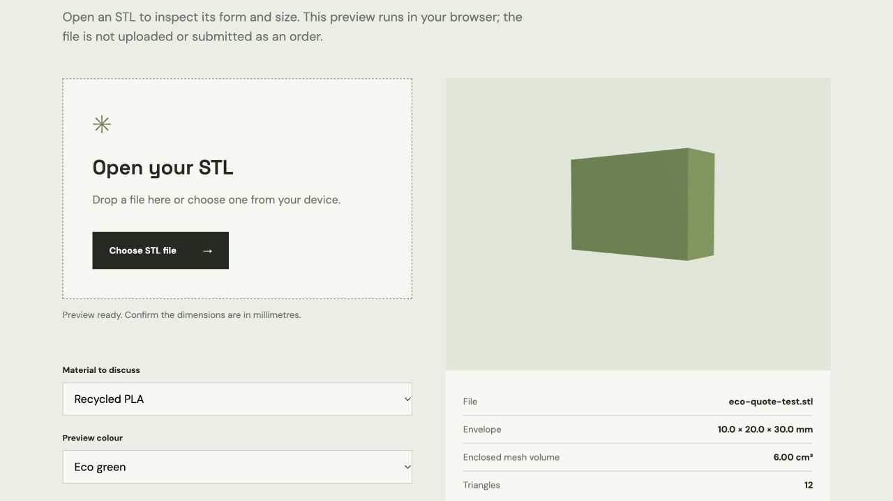

# Eco Layer Labs reference and local prototype audit — 8 October 2026

## Scope and evidence

The public site at https://ecolayerlabs.com/ was inspected without signing in, uploading a file, or submitting an order. Public HTML and JavaScript were read to map the visible flow. The local project was fetched from `codex/eco-storefront-local-handoff` at `fa487d795367d5e2dd8b5647aa4211c7d33380d5`, installed with `npm ci`, built, tested, and checked in a local browser. Public JavaScript identifies intended collections, but it cannot prove Firestore rules, stored records, payment configuration, or working admin access.

## Reference site

| Area | Observed public behavior |
| --- | --- |
| Catalog | Six visible cards, including two limited drops. The `products` Firestore listener reports a permissions error, then public `js/app.js` uses six hard-coded fallback records. These cards should not be assumed to be live inventory. |
| Cart | A product can now be added, adjusted, and retained across pages through browser local storage. The earlier add-to-cart failure did not reproduce on this date. |
| Custom quote | The public `/upload.html` page accepts an STL, shows a 3D viewer, material and colour choices, and calculates an estimate. Public `js/stl-viewer.js` reads `site_settings/pricing`, falling back to embedded values on a Firestore error. The UI assumes STL dimensions in millimetres and checks a 250 mm build envelope. It is clipped at a 375 px viewport. |
| Accounts and admin | Public scripts use Firebase Authentication and Firestore. Code references `users`, `products`, `orders`, `coupons`, `inventory_materials`, and `site_settings/pricing`. No privileged data or rules were accessed. |
| Checkout | Public `js/cart.js` calls its flow a mock checkout: after authentication it calculates a total in the browser, writes an `orders` document, and displays an order-placed message. No payment was attempted or verified. |
| Content | Mission, materials, shipping, and contact pages are present. The previously observed claim and policy questions remain for review before publication. Product image URLs were broken in this session. `robots.txt` and `sitemap.xml` returned 404. |

## Local prototype compared with the reference

| Capability | Local status | Work needed before release |
| --- | --- | --- |
| Catalog | Three labelled mock concepts unrelated to the six visible reference cards. | Approve real product names, prices, photos or original 3D assets, stock, specifications, and evidence for material or performance claims. |
| 3D | Original procedural models in Three.js. | Decide which approved products need accurate 3D models; provide files or create and verify them. The STL quote viewer is absent. |
| Custom quote | Browser-only STL preview now accepts a file, checks a 250 mm envelope, and measures geometry. The file stays on the device. | Validate printability and scale, agree on pricing, then add a secure quote request and human review workflow. An STL's enclosed volume alone is not a final printable-material or production cost. |
| Cart | Local storage quantities and server-validated Stripe Price IDs. | Verify persistence and failure handling on target devices; agree on inventory rules. |
| Payment | Stripe test Checkout integration exists in code. Three prototype products and prices are in the connected JDC Ventures sandbox; the local Worker has no key. Mock checkout is disabled; live checkout is blocked server-side. | Supply a restricted test key securely to the Worker, test Checkout and signed webhook events, then implement durable, idempotent paid-order recording and fulfillment. |
| Customer workflow | Stripe can collect email, billing and shipping details in test mode. A success page reads session status. | Add order administration, customer support and fulfilment steps, shipping/tax settings, legal pages, and receipts before live use. |
| Hosting | An isolated Worker preview is deployed at `https://eco-storefront-preview.jfdcosta-jdc.workers.dev/`, with a `noindex` header and no Stripe key. A deployed browser cart check passed. | Configure production routes, secrets, observability, and a deployed smoke test only after the business workflow is ready. |

The handoff branch is a working prototype, not a ready replacement for the live site. Passing local tests establishes that its current mock cart and server endpoints run; it does not establish real catalog, payment, STL quote, or fulfillment readiness.

The hosted STL preview below uses a generated 10 × 20 × 30 mm test cube, not a customer file.

## Stripe sandbox state

The connected account is `JDC VENTURES LTD sandbox` (`acct_1UODLe06PcSYJA8k`, `livemode=false`). It was empty before seeding. The three products and their default prices were verified after creation:

| Prototype | Stripe product | Default price | GBP |
| --- | --- | --- | ---: |
| Eco Strap | `prod_VP73eiP0pokaJK` | `price_1UOIoz06PcSYJA8kQI5KPAJH` | £18.00 |
| Modular Bottle | `prod_VP73ZJf359BE05` | `price_1UOIpE06PcSYJA8kC57dT1bC` | £28.00 |
| Desk Set | `prod_VP73lchO9O4Kmm` | `price_1UOIpJ06PcSYJA8kQSoXWz6f` | £42.00 |

These are sandbox records, not real inventory. Stripe returned `type: service` for them despite `shippable: true`; product type and tax codes need review before creating a live catalog. `npm audit --omit=dev` found no production dependency advisories; the full audit reported three high severity findings in the Wrangler/Miniflare/Sharp development dependency chain.
